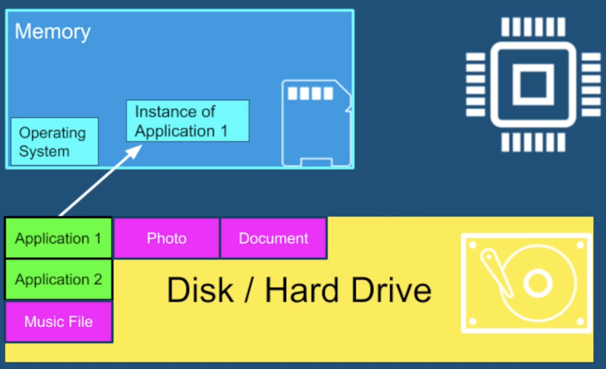
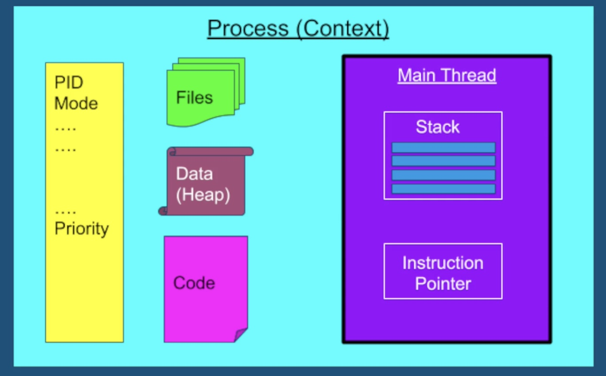
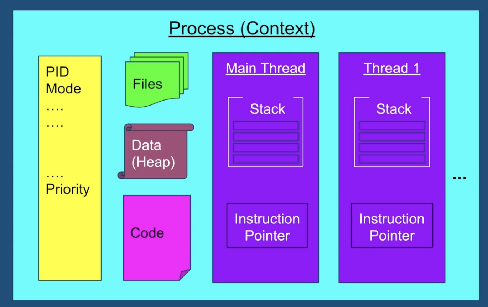
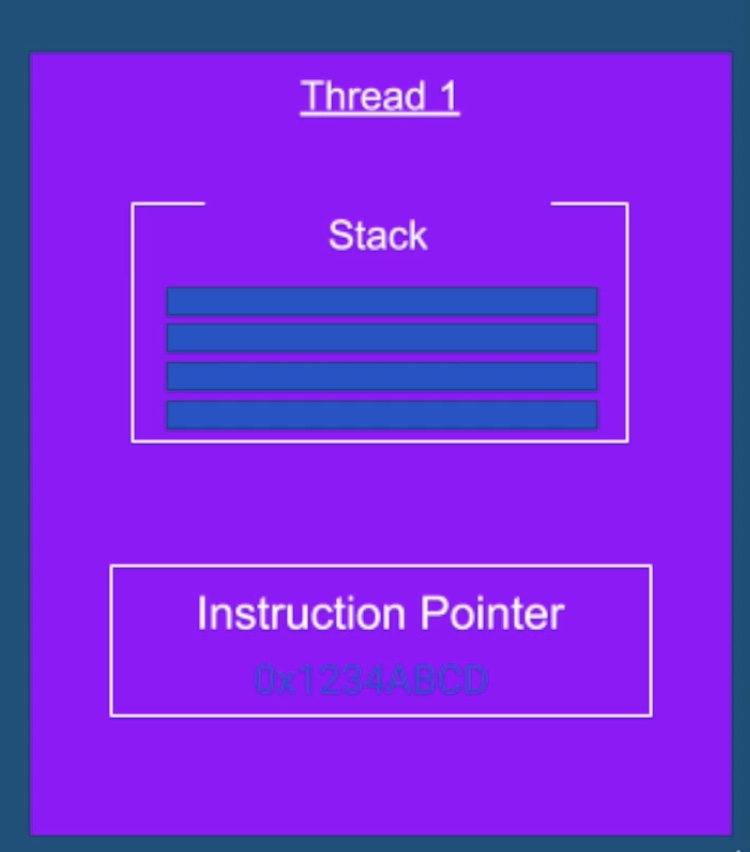

# java-multithread
This is the udemy course for java multithread and concurrency

   

# 1. introduction

## 1.1 Motivation - why we need Threads?

### 1.1.1 Responsiveness - Concurrency

- example of poor responsiveness
    - waiting for customer support
    - late response from a person
    - no feedback from an application

- responsiveness with a single thread
    - 2nd user will be blocked until the 1st user is done
    - 

- responsiveness with a  multithreading
    - they can complete their tasks in parallel
    - 

- Responsive in User Interface
    - responsivenesss is particularly critical in applications with a user intetface

#### concurrency - multitasking 
- responsivenss can be achieved by using multiple threads, with a separate thread for each task
- generally very hard to achieve otherwise
- achieved by multi-tasking between threads
- `concurrency = multitasking` 
- we dont need multiple cores to achieve concurrency 

   

### 1.1.2 Performance - Parallelism
- we can create an `illusion` of multiple tasks executing in parallel using just a single core
- with `multiple cores` we can truly run tasks completely in parallel

#### Impact
- completing a complex task much faster
- finish more work in the same period of time
- for high scale service
    - fewer machines
    - less money spent on hardware

   

## 1.2 Multithreading Caveat
- multithreaded programming is fundamentally different from single threaded programming
- in this course we will lay the groundwork, and learn all the tools to become a successful multithreaded programming developer

   

## 1.3 what threads are - introduction of OS

### 1.3.1 what threads are and where they live?
- 

### 1.3.2 single threaded application process
- 

### 1.3.3 multithreaded application process
- all other contents are shared by all threads
    - 

### 1.3.4 what the thread contains?
- `stack` - region in memory, where local variables are stored, and passed into functions

- `instruction pointer` - address of the next instruction to execute

- 

   

## 1.4 Summary
- motivation for multithreading
    - responsiveness achieved by concurrency
    - performance achieved by parallelism

- threads are and what they contain
    - stack 
    - instruction pointer

- what threads share
    - files
    - heap
    - code

   

## 1.5 context switch

   

## 1.6 thread scheduling

   

## 1.7 threads vs processes
