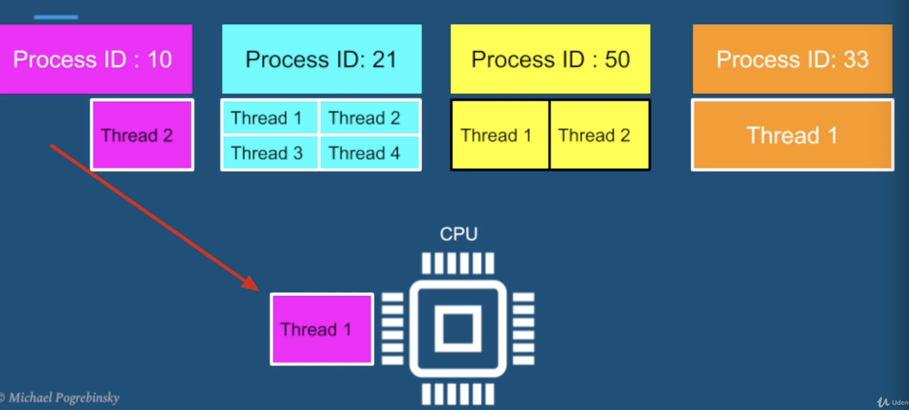

# java-multithread
This is the udemy course for java multithread and concurrency


# 0. Java tips
1. diamond operator is not supported in -source 1.5
```pom
1. specify java version in pom
<!-- https://www.baeldung.com/maven-java-version -->
    <properties>
        <maven.compiler.target>1.8</maven.compiler.target>
        <maven.compiler.source>1.8</maven.compiler.source>
    </properties>

2. project structure make it 1.8

```


<br><br><br><br><br><br>


# 1. introduction

## 1.1 Motivation - why we need Threads?

### 1.1.1 Responsiveness - Concurrency

- example of poor responsiveness
    - waiting for customer support
    - late response from a person
    - no feedback from an application

- responsiveness with a single thread
    - 2nd user will be blocked until the 1st user is done
    - 

- responsiveness with a  multithreading
    - they can complete their tasks in parallel
    - 


- Responsive in User Interface
    - responsivenesss is particularly critical in applications with a user intetface

#### concurrency - multitasking 
- responsivenss can be achieved by using multiple threads, with a separate thread for each task
- generally very hard to achieve otherwise
- achieved by multi-tasking between threads
- `concurrency = multitasking` 
- we dont need multiple cores to achieve concurrency 

<br><br><br>

### 1.1.2 Performance - Parallelism
- we can create an `illusion` of multiple tasks executing in parallel using just a single core
- with `multiple cores` we can truly run tasks completely in parallel

#### Impact
- completing a complex task much faster
- finish more work in the same period of time
- for high scale service
    - fewer machines
    - less money spent on hardware

<br><br><br>

## 1.2 Multithreading Caveat
- multithreaded programming is fundamentally different from single threaded programming
- in this course we will lay the groundwork, and learn all the tools to become a successful multithreaded programming developer


<br><br><br>

## 1.3 what threads are - introduction of OS

### 1.3.1 what threads are and where they live?
- 


### 1.3.2 single threaded application process
- 


### 1.3.3 multithreaded application process
- all other contents are shared by all threads
    - 


### 1.3.4 what the thread contains?
- `stack` - region in memory, where local variables are stored, and passed into functions

- `instruction pointer` - address of the next instruction to execute

- 


<br><br><br>

## 1.4 Summary
- motivation for multithreading
    - responsiveness achieved by concurrency
    - performance achieved by parallelism

- threads are and what they contain
    - stack 
    - instruction pointer

- what threads share
    - files
    - heap
    - code


<br><br><br>

## 1.5 context switch

- OS (operation system) will run one thread and stop it, then run another thread
    - 

<br>

- context switch
    - stop thread 1
    - schedule thread 1 out
    - schedule thread 2 in
    - start thread 2
- 


- context switch cost
    - context switch is not cheap, and is the price of multitasking(concurrency)
    - same as humans when we multitask - takes time to focus
    - each thread consumes resources in the CPU and memory
    - when we switch to a different thread:
        - store data for one thread
        - restore data for another thread

- context switch - key takeaways
    - too many threads - thrashing, spending more time in management than real productive work
    - threads consume less resources than processes
    - context switching between threads from the same process is cheaper than context switch between different processes

<br><br><br>

## 1.6 thread scheduling
1. setup 
    - music player
        - 1 thread for playing music
        - 1 thread for UI
    - Text editor
        - 1 thread for file server
        - 1 thread for UI


### 1.6.1 how to schedule which thread execute first?

- first come first serve
    - problem - long thread can cause starvation
    - may cause user interface threads being unresponsive - bad user experience
    - 

- shortest job first
    - user interactive will always be execute first
    - but long thread involing computation may never be executed
    - 

<br>

### 1.6.2 how it real works?
- epochs
    - OS divides time into moderately sized pieces called epochs
    - 

- Time slices
    - OS allocate each time slice for each thread
    - not all threads get to run or complete in each epochs
    - 

- dynamic priority (`strategy`)
    - `Dynamic Priorty` = Static Priority + Bonus 
        - (bonus can be negative)
    - static priority is set by the developer programmatically  
    - Bonus is adjusted by the OS in every epoch for each thread
    - using dp, the OS will give preference for interactive threads(such as UI threads)
    - OS will give preference to threads that did not complete in the last epochs, or did not get enough time to run - preventing `Starvation`


<br><br><br>

## 1.7 threads vs processes
- multi threads
    - 

<br>

- multi processes
    - 
    

### 1.7.1 when to prefer multithreaded architecture
    - prefer if the tasks share a lot of data
    - threads are much faster to create and destroy
    - switching between threads of the same process is faster (shorter context switches)

<br>

### 1.7.2 when to prefer multi-processes architecture
    - security and stability are of higher importance
    - tasks are unrelated to each other

<br><br><br>

## 1.8 summary
- context switches, and their impact on performance
- how thread scheduling works in the operating system
- when to prefer multithreaded over multi-processes architecture
- [inside the linux 2.6 completely fair scheduler](https://developer.ibm.com/tutorials/l-completely-fair-scheduler/)
- Java [Thread.State](https://docs.oracle.com/javase/8/docs/api/java/lang/Thread.State.html)


<br><br><br><br><br><br>

# 2. Threading fundamentals - Thread creation

## 2.1 Threads creation - part 1, thread capabilities & debugging
1. Thread creation with java.lang.Runnable
2. Thread class capabilities
3. Thread Debugging

- main thread is destroyed by jvm while new thread still running
    - 
    

```java
// example 1
package thread.creation;

/**
 * @Author: Rick
 * @Date: 2023/12/9 14:20
 */
public class example {

    public static void main(String[] args) throws InterruptedException {
        Thread thread = new Thread(new Runnable() {
            public void run() {
                System.out.println("we are in thread " + Thread.currentThread().getName());
                try {
                    Thread.sleep(1000);
                } catch (InterruptedException e) {
                    throw new RuntimeException(e);
                }
                System.out.println("Current thread priority id " + Thread.currentThread().getPriority());
            }
        });

        thread.setName("New worker Thread");
        // priority [1, 10]
        thread.setPriority(Thread.MAX_PRIORITY);

        System.out.println("We are in thread: " + Thread.currentThread().getName() + " before starting a new thread");
        thread.start();
        System.out.println("We are in thread: " + Thread.currentThread().getName() + " after starting a new thread");

    }
}


```


```java
// example 2
package thread.creation;

/**
 * @Author: Rick
 * @Date: 2023/12/9 14:20
 */
public class example2 {

    public static void main(String[] args) throws InterruptedException {
        Thread thread = new Thread(new Runnable() {
            public void run() {
                // code that will in a new thread
                throw new RuntimeException("Intentional Exception");
            }
        });

        thread.setName("Misbehaving thread");
        thread.setUncaughtExceptionHandler(new Thread.UncaughtExceptionHandler(){
            public void uncaughtException(Thread t, Throwable e) {
                System.out.println("A critical error in thread " + t.getName()
                        + " the error is " + e.getMessage());
            }
        });

        thread.start();
    }
}


```

<br><br><br>

## 2.2 Threads creation - part 2, thread inheitance
1. Thread creation with java.lang.Thread
2. case study - interactive multithreaded application
    - 

```java
package thread.creation.example2;


import java.util.ArrayList;
import java.util.List;
import java.util.Random;

/**
 * @Author: Rick
 * @Date: 2023/12/11 10:55
 */
public class example2 {

    public static final int MAX_PASSWORD = 9999;

    public static void main(String[] args) {


        // for (int i = 1; i <= 20; i++) {
        // System.out.println("competition round " + i);

        Random random = new Random();

        Vault vault = new Vault(random.nextInt(MAX_PASSWORD));
        List<Thread> threads = new ArrayList<>();

        threads.add(new AscendingHackerThread(vault));
        threads.add(new DescendingHackerThread(vault));
        threads.add(new PoliceThread());

        for (Thread thread : threads){
            thread.start();
        }
        // }

    }

    private static class Vault {
        private int password;

        public Vault(int password) {
            this.password = password;
        }

        public boolean isCorrectPassword(int guess) {
            try {
                Thread.sleep(5);
            } catch (InterruptedException e) {
                throw new RuntimeException(e);
            }
            return this.password == guess;
        }
    }

    private static abstract class HackerThread extends Thread {
        protected Vault vault;

        public HackerThread(Vault vault) {
            this.vault = vault;
            this.setName(this.getClass().getSimpleName());
            this.setPriority(Thread.MAX_PRIORITY);
        }

        @Override
        public void start() {
            System.out.println("Starting thread " + this.getName());
            super.start();
        }
    }

    private static class AscendingHackerThread extends HackerThread {
        public AscendingHackerThread(Vault vault) {
            super(vault);
        }

        @Override
        public void run() {
            for (int guess = 0; guess < MAX_PASSWORD; guess++) {
                if (vault.isCorrectPassword(guess)) {
                    System.out.println(this.getName() + " guessed the password " + guess);
                    System.exit(0);
                }
            }
        }
    }

    private static class DescendingHackerThread extends HackerThread {
        public DescendingHackerThread(Vault vault) {
            super(vault);
        }

        @Override
        public void run() {
            for (int guess = MAX_PASSWORD; guess >= 0; guess--) {
                if (vault.isCorrectPassword(guess)) {
                    System.out.println(this.getName() + " guessed the password " + guess);
                    System.exit(0);
                }
            }
        }
    }

    private static class PoliceThread extends Thread {
        @Override
        public void run() {
            for (int i = 10; i > 0; i--) {
                try {
                    Thread.sleep(1000);
                } catch (InterruptedException e) {

                }
                System.out.println(i);
            }
            System.out.println("Game over for you hacker");
            System.exit(0);
        }
    }
}

```

3. Summary
    - thread class - encapsulates all thread related functionality
    - two ways to run code on a new thread
        - implement Runnable interface, and pass to a new Thread object
        - Extend Thread class, and create an object of the class
    - both ways are equally correct


4. MultiExecutor
```java
package thread.creation;

import java.util.ArrayList;
import java.util.List;

/**
 * @Author: Rick
 * @Date: 2023/12/11 11:48
 */
public class MultiExecutor {

    private final List<Runnable> tasks;
    public MultiExecutor(List<Runnable> tasks) {
        this.tasks = tasks;
    }

    public void executeAll(){
        for (Runnable task : tasks){
            Thread thread  = new Thread(task);
            thread.start();
        }
    }

    // public void executeAll(){
    //     List<Thread> threads = new ArrayList<>(tasks.size());

    //     for (Runnable task : tasks){
    //         Thread thread  = new Thread(task);
    //         threads.add(thread);
    //     }

    //     for (Thread thread : threads){
    //         thread.start();
    //     }

    // }
}

```