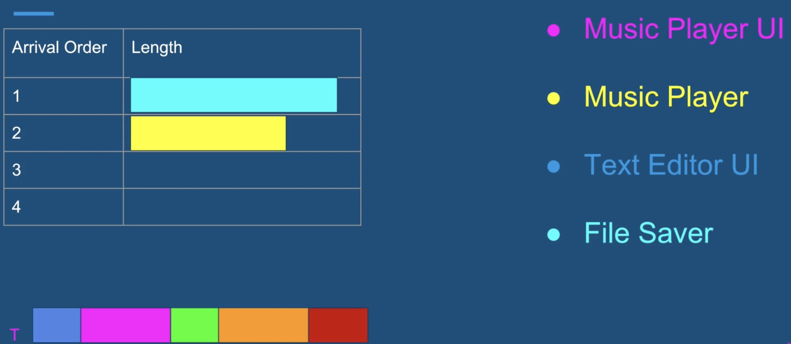

# java-multithread
This is the udemy course for java multithread and concurrency

   

# 1. introduction

## 1.1 Motivation - why we need Threads?

### 1.1.1 Responsiveness - Concurrency

- example of poor responsiveness
    - waiting for customer support
    - late response from a person
    - no feedback from an application

- responsiveness with a single thread
    - 2nd user will be blocked until the 1st user is done
    - 

- responsiveness with a  multithreading
    - they can complete their tasks in parallel
    - 

- Responsive in User Interface
    - responsivenesss is particularly critical in applications with a user intetface

#### concurrency - multitasking 
- responsivenss can be achieved by using multiple threads, with a separate thread for each task
- generally very hard to achieve otherwise
- achieved by multi-tasking between threads
- `concurrency = multitasking` 
- we dont need multiple cores to achieve concurrency 

   

### 1.1.2 Performance - Parallelism
- we can create an `illusion` of multiple tasks executing in parallel using just a single core
- with `multiple cores` we can truly run tasks completely in parallel

#### Impact
- completing a complex task much faster
- finish more work in the same period of time
- for high scale service
    - fewer machines
    - less money spent on hardware

   

## 1.2 Multithreading Caveat
- multithreaded programming is fundamentally different from single threaded programming
- in this course we will lay the groundwork, and learn all the tools to become a successful multithreaded programming developer

   

## 1.3 what threads are - introduction of OS

### 1.3.1 what threads are and where they live?
- 

### 1.3.2 single threaded application process
- 

### 1.3.3 multithreaded application process
- all other contents are shared by all threads
    - 

### 1.3.4 what the thread contains?
- `stack` - region in memory, where local variables are stored, and passed into functions

- `instruction pointer` - address of the next instruction to execute

- 

   

## 1.4 Summary
- motivation for multithreading
    - responsiveness achieved by concurrency
    - performance achieved by parallelism

- threads are and what they contain
    - stack 
    - instruction pointer

- what threads share
    - files
    - heap
    - code

   

## 1.5 context switch

- OS (operation system) will run one thread and stop it, then run another thread
    - 

 

- context switch
    - stop thread 1
    - schedule thread 1 out
    - schedule thread 2 in
    - start thread 2
- 

- context switch cost
    - context switch is not cheap, and is the price of multitasking(concurrency)
    - same as humans when we multitask - takes time to focus
    - each thread consumes resources in the CPU and memory
    - when we switch to a different thread:
        - store data for one thread
        - restore data for another thread

- context switch - key takeaways
    - too many threads - thrashing, spending more time in management than real productive work
    - threads consume less resources than processes
    - context switching between threads from the same process is cheaper than context switch between different processes

   

## 1.6 thread scheduling
1. setup 
    - music player
        - 1 thread for playing music
        - 1 thread for UI
    - Text editor
        - 1 thread for file server
        - 1 thread for UI

### 1.6.1 how to schedule which thread execute first?

- first come first serve
    - problem - long thread can cause starvation
    - may cause user interface threads being unresponsive - bad user experience
    - 

- shortest job first
    - user interactive will always be execute first
    - but long thread involing computation may never be executed
    - 

 

### 1.6.2 how it real works?
- epochs
    - OS divides time into moderately sized pieces called epochs
    - 

- Time slices
    - OS allocate each time slice for each thread
    - not all threads get to run or complete in each epochs
    - 

- dynamic priority (`strategy`)
    - `Dynamic Priorty` = Static Priority + Bonus 
        - (bonus can be negative)
    - static priority is set by the developer programmatically  
    - Bonus is adjusted by the OS in every epoch for each thread
    - using dp, the OS will give preference for interactive threads(such as UI threads)
    - OS will give preference to threads that did not complete in the last epochs, or did not get enough time to run - preventing `Starvation`

   

## 1.7 threads vs processes
- multi threads
    - 

 

- multi processes
    - 

### 1.7.1 when to prefer multithreaded architecture
    - prefer if the tasks share a lot of data
    - threads are much faster to create and destroy
    - switching between threads of the same process is faster (shorter context switches)

 

### 1.7.2 when to prefer multi-processes architecture
    - security and stability are of higher importance
    - tasks are unrelated to each other

   

## 1.8 summary
- context switches, and their impact on performance
- how thread scheduling works in the operating system
- when to prefer multithreaded over multi-processes architecture
- [inside the linux 2.6 completely fair scheduler](https://developer.ibm.com/tutorials/l-completely-fair-scheduler/)
- Java [Thread.State](https://docs.oracle.com/javase/8/docs/api/java/lang/Thread.State.html)

